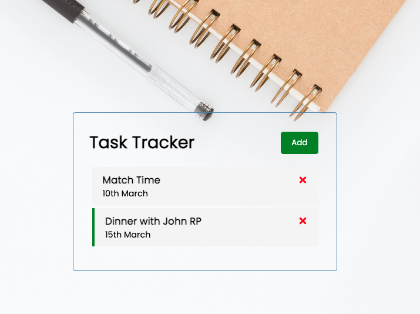

# React Task Tracker

In this project I've developed a React Task Tracker Responsive App.
You're able to add New Task & delete it.

## Built with....

This project was developed with the following technologies:

- [React](https://en.reactjs.org/)
- [UseState Hook](https://reactjs.org/docs/hooks-state.html)

## Getting Started - Installation

1. To deploy this project you must clone the repository through the following link:

```
https://github.com/Vincecoorp21/React-News-App-2.0
```

2. Install all npm packages.

```
npm i
```

3. Launch the project.

```
npm start

```

## Preview



## Author

👤 **Vince BC**

- Twitter: [@VinceTrend](https://twitter.com/VinceTrend)
- Github: [@Vincecoorp21](https://github.com/Vincecoorp21)
- Linkedin:[@vibarcar](https://www.linkedin.com/in/vibarcar/)

This project was developed By [Vicente Barberá - Vince BC -](https://github.com/Vincecoorp21)
